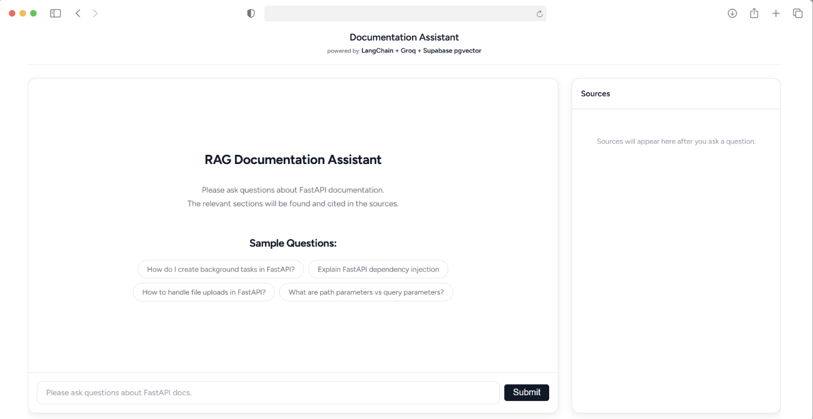

# RAG Documentation Assistant

A Retrieval-Augmented Generation (RAG) assistant that answers technical questions from **FastAPI** official documentation with source citations. Built with LangChain, FastAPI, Next.js, Supabase pgvector, and Groq.

[Live Demo](https://rag-doc-assistant-one.vercel.app/)

---



---

## Tech Stack

| Layer        | Technology                        | Purpose                              |
|-------------|-----------------------------------|--------------------------------------|
| Frontend    | Next.js (App Router), React, JS   | Chat UI + sources panel              |
| Backend     | FastAPI, Uvicorn, Python 3.11     | REST API + RAG                       |
| RAG Engine  | LangChain                         | Retrieval + prompting + generation   |
| Embeddings  | BAAI/bge-small-en-v1.5 (384 dim)  | Text embeddings                      |
| LLM         | Groq (Llama 3.1 8B Instant)       | Fast cloud inference                 |
| Vector DB   | Supabase Postgres + pgvector      | Similarity search with filtering     |
| Hosting     | Vercel + HF Spaces                | Deployment                           |

---

## Features

- **Answers** : The LLM answers from retrieved documentation
- **Source citations** : Every answer includes links to original documents
- **Sources panel** : See retrieved chunks with similarity scores and snippets
- **Rate limit handling** : Clear error messages for Groq free tier limits

---

## Quick Start (Local Development)

### Prerequisites

- Python 3.11+
- Node.js 18+
- Supabase project (free tier)
- Groq API key (free tier)

### 1. Clone and setup

```bash
git clone https://github.com/Atakan97/rag-doc-assistant.git
cd rag-doc-assistant
cp .env.example .env
# Fill in your SUPABASE_URL, SUPABASE_SERVICE_ROLE_KEY, GROQ_API_KEY
```

### 2. Setup Supabase

1. Create a free Supabase project at [supabase.com](https://supabase.com)
2. Go to SQL Editor and run the contents of `infra/supabase.sql`
3. This creates the `chunks` table, indexes, and `match_chunks` RPC function

### 3. Run ingestion (one time)

```bash
cd ingest
pip install -r requirements.txt
python ingest.py          
python ingest.py --dry-run 
```

This will clone the FastAPI repo, process the markdown files, generate embeddings, and insert them into Supabase.

### 4. Start the backend

```bash
cd backend
pip install -r requirements.txt
uvicorn app.main:app --reload --port 7860
```

The API will be available at `http://localhost:7860`.

### 5. Start the frontend

```bash
cd frontend
npm install
npm run dev
```

Open `http://localhost:3000` in your browser.

---

## API Documentation

The backend provides a **Swagger UI** for testing the RAG endpoints. You can explore the request/response schemas and try queries directly from your browser.

- **Interactive Docs:** [https://atakan97-rag-documentation-assistant.hf.space/docs](https://atakan97-rag-documentation-assistant.hf.space/docs)

---

## Deployment

### Backend - Hugging Face Spaces (Docker)

1. Create a new Space on [huggingface.co](https://huggingface.co/new-space)
2. Select **Docker** as the SDK
3. Push the `backend/` directory to the Space repo
4. Add secrets in Space settings:
   - `SUPABASE_URL`
   - `SUPABASE_SERVICE_ROLE_KEY`
   - `GROQ_API_KEY`
   - `CORS_ORIGINS=https://your-app.vercel.app`

### Frontend - Vercel

1. Import the repo on [vercel.com](https://vercel.com)
2. Set root directory to `frontend/`
3. Add environment variable:
   - `NEXT_PUBLIC_API_URL=https://your-space.hf.space`
4. Deploy

---

## Data Sources & Licenses

| Collection | Repository                                             | License |
|------------|--------------------------------------------------------|---------|
| FastAPI    | [fastapi/fastapi](https://github.com/fastapi/fastapi) | MIT     |

**Ingested path:**
- **FastAPI:** `docs/en/docs/**/*.md`

---

## Optional: Local High-Quality Mode (Ollama)

For local development with a larger model:

1. Install [Ollama](https://ollama.ai)
2. Pull a model: `ollama pull qwen2.5:7b-instruct`
3. Set in `.env`:
   ```
   LLM_PROVIDER=ollama
   OLLAMA_BASE_URL=http://localhost:11434
   OLLAMA_MODEL=qwen2.5:7b-instruct
   ```

---

## License

This project is open source. See data source license above.
